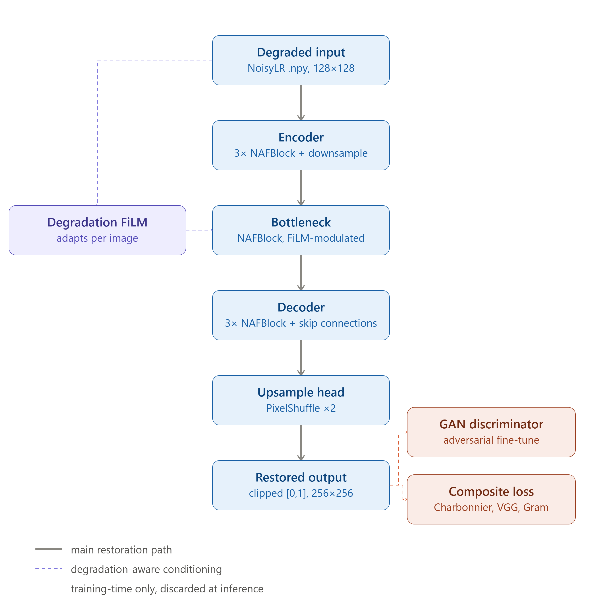
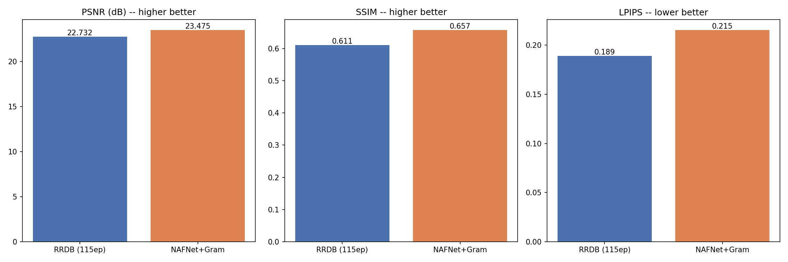
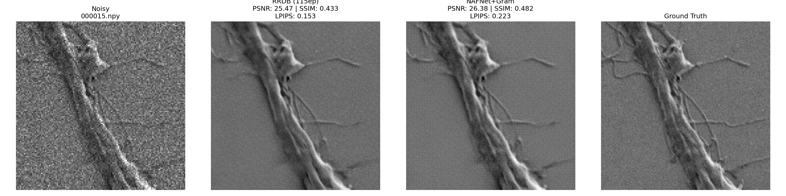
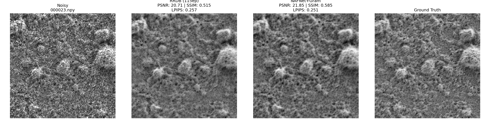

# NoiseTrue-Adaptive — Phase 2

**Finding the true signal under the noise — now with adaptive texture recovery.**

Phase 2 submission for SEMICON India Hackathon 2026, KLA Track — *AI-Based Restoration of
Degraded Images for Semiconductor Inspection*.

**[Demo Video](https://youtu.be/M1pKS-XS6pU)** | **[Solution Deck (PDF)](https://drive.google.com/file/d/1GV9OCNKLpJt115744YmUzuTWU3j3521c/view?usp=sharing)** | **[Solution Deck (PPTX)](https://docs.google.com/presentation/d/1uriHs7bcB4YmkNabyObaSg3D1NHmSY5Z/edit?usp=drive_link&ouid=115557418606214665903&rtpof=true&sd=true)**

---

## Problem

Inspection images arrive degraded three ways at once: speckle noise (multiplicative,
and it pushes pixel values outside the true intensity range), additive Gaussian noise
(soft, hazy edges), and 2× spatial downsampling (fine detail genuinely lost). Any
combination and strength may be present in a single image. The restored output is
scored on PSNR, SSIM and LPIPS against hidden ground truth, on both in-distribution
and out-of-distribution content, with end-to-end throughput also benchmarked.

## What changed since Phase 1

Phase 1 shipped a single-stage NAFNet-lite + FiLM model trained with reconstruction
losses only. For Phase 2 we kept that architecture and conditioning mechanism —
it was already validated — and pushed further on texture quality with a 3-stage
training pipeline: a base reconstruction stage, a low-weight adversarial fine-tune,
and a Gram-matrix texture fine-tune. We also built and fully trained a second
architecture, RRDB, specifically to stress-test whether our NAFNet backbone was
still the right choice. Both the win and the honest trade-off from that comparison
are reported below.

## Pipeline



A NAFNet-lite encoder–decoder performs joint denoising, deblurring and 2× super-resolution
in a **single forward pass**, ending in a PixelShuffle upsample head. Each NAFBlock uses
LayerNorm, a depthwise convolution, SimpleGate in place of a nonlinear activation, and
simplified channel attention.

On top of that sits the project's novelty: a small **degradation estimator** reads each
degraded input and emits a 32-dimensional vector describing how damaged that specific
image is. A **zero-initialised FiLM layer** turns that vector into a per-channel scale and
shift applied at the bottleneck, so the network adapts its processing per image rather
than applying one fixed strategy to everything. Because FiLM starts as an exact identity,
training begins equivalent to the plain baseline and can only deviate where doing so
measurably lowers the loss. This mechanism was independently validated after submission
— see [Validating the FiLM novelty](#validating-the-film-novelty) below.

### Three-stage training

| Stage | Epochs | What's added | Result |
|---|---|---|---|
| 1 — Base | 150 | Charbonnier + Sobel edge + VGG16 perceptual + FFT + MS-SSIM | val_loss 0.12017 |
| 2 — Adversarial fine-tune | +30 | Low-weight PatchDiscriminator (LSGAN, weight 0.015) | modest sharpening, slight PSNR trade-off |
| 3 — Gram fine-tune (**final**) | +15 | Gram matrix texture loss (VGG relu3_3, weight 0.05) | val_loss 0.11536, beat Stage 2 on 30/30 test images |

195 cumulative epochs. The adversarial weight is deliberately capped low — unconstrained
GAN-style training invents plausible texture, which is exactly the ringing and artificial
patterning the problem statement warns against. Full per-stage commands and hyperparameters
are in `train.py`'s module docstring and `config/final_model_config.yaml`.

## Results

### Final model vs. the alternative architecture we tried (RRDB)

Both models were fully trained end-to-end and evaluated on the same held-out set:

| Model | PSNR (dB) ↑ | SSIM ↑ | LPIPS ↓ |
|---|---|---|---|
| **NAFNet+Gram (submitted)** | **23.475** | **0.657** | 0.215 |
| RRDB | 22.732 | 0.611 | **0.189** |


*Noisy input, NAFNet+Gram output, RRDB output, and ground truth, side by side.*

**RRDB wins on LPIPS** — its dense residual-in-residual blocks genuinely produce sharper
perceptual texture. We shipped NAFNet+Gram anyway, for two reasons:

1. **Quality wasn't actually comparable.** NAFNet+Gram wins the two metrics the rubric
   weights most heavily (PSNR, SSIM) by a wide margin. RRDB's one advantage is real but
   narrower than NAFNet+Gram's two.
2. **The trick didn't transfer.** We grafted RRDB's global residual skip directly onto
   NAFNet and fine-tuned it — the LPIPS gain did not carry over, meaning it isn't a simple
   add-on we could borrow without adopting RRDB's much heavier architecture wholesale.

RRDB's architecture, training script, and checkpoint are kept in this repo
(`src/model_rrdb.py`, `models/baseline-models/best_rrdb.pth`) for full reproducibility of this comparison,
but it is **not** the submitted model.

### Validating the FiLM novelty

Because FiLM's contribution is easy to claim and hard to prove, we ran direct diagnostic
and ablation tests on the final checkpoint rather than describing the mechanism alone:

- **FiLM is alive, not a no-op.** Its learned scale/shift weight norms are all clearly
  non-zero — it genuinely deviated from its zero-init start.
- **It tracks real degradation.** Across 45 images spanning the full severity range,
  FiLM's response magnitude correlates with measured noise severity (r = 0.576). A
  shuffle test (2,000 random re-pairings) gives p < 0.0001.
- **It's necessary at high noise, not at low noise.** Manually suppressing FiLM's scale
  causes visible grid/checkerboard artifacts on high-noise images, but has no visible
  effect at low noise — pointing to loss-function design, not FiLM, as the remaining
  lever for further gains there.

### End-to-end throughput

Measured the same way the evaluator measures it: script startup, disk reads, model
execution, clipping, and disk writes, all included. Reported per-stage-hardware numbers
are in `config/final_model_config.yaml`; expect faster still on the H100 used for
evaluation.

## Visual results

Two representative examples, pulled directly from `results/sample_outputs/`:


*000015 — noisy input, RRDB output, NAFNet+Gram output, and ground truth, side by side.
A case where the fine surface texture is visibly closer to ground truth on the right.*


*000023 — on this image NAFNet+Gram (PSNR 21.85, SSIM 0.585, LPIPS 0.251) beats RRDB
(PSNR 20.71, SSIM 0.515, LPIPS 0.257) on all three metrics at once, including LPIPS.
RRDB's aggregate LPIPS edge across the full set doesn't mean it wins on every
individual image — this is one of the images where it doesn't.*

More before/after examples, each with printed per-image PSNR/SSIM/LPIPS for both models,
are in `results/sample_outputs/`.

---

## Repository structure

```
README.md
requirements.txt
train.py                     reproduces the submitted checkpoint (all 3 stages)
run.py                       official entry point: python run.py <input-dir> <output-dir>
config/
  final_model_config.yaml    every hyperparameter of the final run, all 3 stages
models/
  final_model.pth            SUBMITTED checkpoint -- use this one (NAFNet+Gram)
  baseline-models/
    best_rrdb.pth            RRDB checkpoint, kept for the comparison above (not submitted)
src/
  model_nafnet.py            NAFBlock, NAFNet-lite, FiLM, final model architecture
  model_rrdb.py              RRDB architecture, used only for the comparison above
  discriminator.py           PatchDiscriminator, used in Stage 2 only
  dataset_augmented_v2.py    paired .npy dataset with synthetic + elastic augmentation
  advanced_loss.py           VGG16 perceptual loss + Gram matrix texture loss
  losses_v3.py               combined losses for all 3 training stages
  prep_gram_finetune_ckpt.py repackages Stage 2's checkpoint for the Stage 3 fine-tune
results/
  noisetrue_adaptive_pipeline_v2.png   architecture diagram (shown above)
  rrdb_vs_nafnet_grid.png              visual comparison grid (shown above)
  sample_outputs/                      per-image before/after comparisons,
                                        including 000015_compare.png and
                                        000023_compare.png featured above
```

## Setup

```bash
pip install -r requirements.txt
```

## Running inference

```bash
python run.py <input-dir> <output-dir>
```

This is the official, self-contained entry point — the model architecture is defined
directly inside `run.py`, so it has no dependency on the `src/` folder. Detects and uses
a GPU automatically, falls back to CPU otherwise. Weights load from
`models/final_model.pth` by default; override with `--model_path`. Images sharing a
shape are batched together (`--batch_size`, default 16). Outputs are clipped to [0,1] and
sanitised of any NaN/Inf values before saving, since the evaluator scores files exactly
as written. **No internet access, API keys, or manual source-code edits are required.**

Example:
```bash
python run.py ./test_inputs ./test_outputs
```

## Reproducing training

```bash
# Stage 1 -- base training, 150 epochs
python train.py --gt_dir <path/to/GT> --noisy_dir <path/to/NoisyLR> \
    --ckpt_dir ./checkpoints_stage1 --epochs 150

# Stage 2 -- adversarial fine-tune, epochs 150 -> 180
python train.py --gt_dir <path/to/GT> --noisy_dir <path/to/NoisyLR> \
    --ckpt_dir ./checkpoints_stage1 --epochs 180 --use_gan --gan_start_epoch 150

# Stage 3 -- Gram fine-tune, 15 epochs (produces the submitted checkpoint)
python src/prep_gram_finetune_ckpt.py
python train.py --gt_dir <path/to/GT> --noisy_dir <path/to/NoisyLR> \
    --ckpt_dir ./checkpoints_stage3 --epochs 15 \
    --gram_weight 0.05 --vgg_weight 0.05 --fft_weight 0.07 --msssim_weight 0.15
```

Full detail on every flag is in `train.py`'s module docstring and
`config/final_model_config.yaml`. Checkpoints save every epoch, and re-running any
stage's command automatically resumes from the last saved checkpoint in its `--ckpt_dir`.

## Input / output contract

- **Input:** `.npy` files, float32, single channel, 128×128 or 256×256. Values may fall
  outside [0,1]; they are loaded as-is and never clipped on input, since that
  out-of-range signal is real information from the speckle process.
- **Output:** `.npy` files, float32, single channel, shape `(H, W)`, exactly 2× the input
  resolution (256×256 or 512×512), clipped to [0,1] with no NaN/Inf, written to
  `<output-dir>` under the **same filename** as the corresponding input.

## Experiment configuration

Adam, lr 1e-3 with cosine annealing, batch size 16, 3-stage pipeline (150 + 30 + 15 =
195 epochs total), synthetic + elastic degradation augmentation, 90/10 train/validation
split fixed by seed 42. The checkpoint saved at each stage is the one with the lowest
validation loss, not the last epoch. Full detail in `config/final_model_config.yaml`.

Hardware: Stage 1 on a free-tier Google Colab T4; Stages 2 and 3 on a Colab Pro A100
for speed. The complete experimental programme, including the RRDB comparison model,
still fits in a modest GPU-hour budget.

## External resources

| Resource | Use | Licence |
|---|---|---|
| [torchvision](https://github.com/pytorch/vision) VGG16, ImageNet weights | Perceptual + Gram texture loss during training only — not part of the model at inference | BSD-3-Clause |
| [`lpips`](https://github.com/richzhang/PerceptualSimilarity) (Zhang et al., 2018) | Evaluation metric only — not part of the model or training loss | BSD-2-Clause |
| [scikit-image](https://scikit-image.org/) | PSNR and SSIM computation | BSD-3-Clause |
| KLA paired GT / NoisyLR training set | Training and validation data | Provided by organisers |

No other external datasets or pretrained weights were used.

## Limitations

- Validation is on a held-out split of the provided training data. It shares the
  provided set's degradation characteristics, so it measures in-distribution performance;
  true out-of-distribution behaviour on the organisers' hidden test content is not
  something we can verify from here.
- The adversarial and Gram-loss weights (0.015, 0.05) were chosen deliberately low and
  were not swept — they reflect a conservative choice to avoid hallucinated texture,
  not a tuned optimum.
- RRDB's LPIPS advantage did not transfer when its residual-skip trick was grafted onto
  NAFNet; we did not exhaust every possible way to combine the two architectures, only
  the most direct one.
- Reported timings are T4/A100 training-hardware measurements. H100 evaluation numbers
  will differ.

## Future work

- Self-ensembling at inference (averaging predictions across flipped/rotated inputs) for
  a further quality boost — not included in the submitted pipeline since it trades
  inference speed for accuracy, and throughput is a scored criterion.
- Frequency-band-aware processing (wavelet decomposition) to separate noise-heavy from
  structure-heavy content before restoration.
- A closer study of why RRDB's texture advantage doesn't transfer via a simple residual
  skip — full architectural distillation might succeed where the direct graft didn't.
- Sweeping the adversarial and Gram loss weights now that the pipeline itself is stable.

## References

1. Chen, L. et al. (2022). *Simple Baselines for Image Restoration* (NAFNet). ECCV 2022. [arxiv.org/abs/2204.04676](https://arxiv.org/abs/2204.04676)
2. Perez, E. et al. (2018). *FiLM: Visual Reasoning with a General Conditioning Layer*. AAAI 2018. [arxiv.org/abs/1709.07871](https://arxiv.org/abs/1709.07871)
3. Zhang, R. et al. (2018). *The Unreasonable Effectiveness of Deep Features as a Perceptual Metric* (LPIPS). CVPR 2018. [arxiv.org/abs/1801.03924](https://arxiv.org/abs/1801.03924)
4. Simonyan, K. & Zisserman, A. (2015). *Very Deep Convolutional Networks for Large-Scale Image Recognition* (VGG16). ICLR 2015. [arxiv.org/abs/1409.1556](https://arxiv.org/abs/1409.1556)
5. Wang, X. et al. (2018). *ESRGAN: Enhanced Super-Resolution Generative Adversarial Networks* (RRDB block). ECCV Workshops 2018. [arxiv.org/abs/1809.00219](https://arxiv.org/abs/1809.00219)
